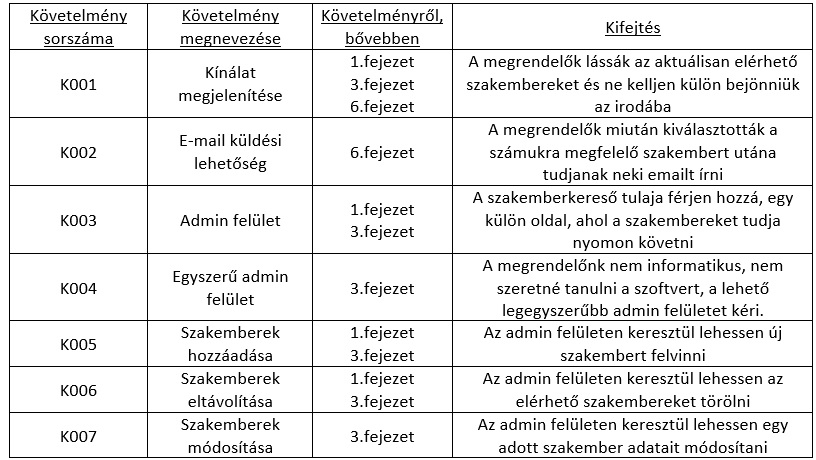

# Funkció specifikáció

## 1. Áttekintés

A rendszer alapvető célja egy szakemberkereső webes felületű alkalmazás mellyel egy szakember üzleti folyamatai válnak egyszerűbbé.
 Az alkalmazás segítségével a megrendelő versenyben marad a rivális szakemberekkel szemben. Az alkalmazás installálása után az 
 szakemberkereső hatékonysága növekedni fog. A rendszernek nem célja, teljes egészében lecserélni a személyes kommunikációt.
  Az alkalmazás elsősorba a szakember és a megrendelő munkáját fogja könnyebbé tenni.

## 2. Jelenlegi helyzet

Jelenleg a szakembereknél azt, hogy ki, milyen szakembert, mikor és miért kért fel, csak papír alapon tekinthető meg. 
A papír alapú módszer, működik, de eléggé lassú, emberi hibából adódóan a félreértések esélye jelentős. A megírt lapok elveszhetnek,
 szennyeződhetnek, az emberi írás mások számára olvashatatlan lehet.Az emberek jelenleg csak úgy tudnak tájékozódni az elérhető szakemberekről,
  azok szakmáiról, munkáiról, ha személyesen bejönnek hozzám. Ezt a plusz utat szeretné a megrendelő kikerülni, azzal, hogy
   online elérhetővé teszi azon autókat melyeket a cég kínál. A megrendelő szereti a modern dolgokat, többek között is ezért is gondolta úgy,
    hogy itt az ideje elkészíteni az alkalmazást.

## 3 Vágyálomrendszer

A megrendelő egy olyan alkalmazást szeretne ami, segítené az ő ügyfeleit abban, hogy elérjék az általuk kínált szakembereket anélkül,
 hogy az ügyfél befáradna az irodánkba, ezzel biztosítani a rugalmasságot, gyorsaságot. A szoftver rendelője a későbbiekben valószínűleg
  továb szeretné fejlesztettni a meglévő applikációt, jelenleg kísérleteznek vele, milyen mértékű pozitív visszajelzéseket kapnak, később
   ennek megfelelően a szoftvert valószínűleg bővíteni kell egyéb funkciókkal.Az elérhető autók listázása mellett e megrendelő szeretné,
    ha gyorsan, egyszerűen lehetne szakembereket hozzáadni a kínálathoz, abban az esetben, ha bővíteni szeretné a kínálatot, valamint a meglévő szakembereket 
    tudja módosítani, szükség esetén eltávolítani a megjelenítendő szakemberek közül, erre egy külön oldalt szeretne, amihez csak ő fér hozzá. Fontos
     számára, hogy egyértelműek legyenek a gombok, a mezők, mit, hova kell beírni, vagy éppen hova, melyik gombra kell kattintani, az egyszerű 
     kezelhetőséget támogatja. Nem szeretne több munkanapot eltölteni azzal, hogy megtanulja használni a szoftvert. A szoftvernek készen kell 
     állnia arra, hogy bővíthető legyen, egyéb funkciókkal, a későbbiekben elképzelhető, hogy a megrendelő szeretne regisztrálási lehetőséget.

## 4. Jelenlegi üzleti folyamatok

A jelenlegi rendszerben az megrendelő ügyfeleinek elkell menniük az én irodámba, vagy el kell látogassanak a szakemberkereső  weboldalára,
 ahol láthatja milyen szakemberekkel rendelkeznek, ezek közül tud választani egyet vagy többet. Ezután a szakemberrel pontosan fixálják az adatokat, hogy mit és mikortól
 lehet kezdeni. A második szakasza az, hogy a munka akkor kezdődik meg ha meg tudnak egyezni a szakemberrel, majd végül elvégzi a munkáját.

## 5. Igényelt üzleti folyamatok

A megrendelő ügyfele otthon, vagy akár a buszon ülve is képes információt szeretni arról, hogy milyen szakemberek lelhetők fel a szakemberkeresőben, 
ezeket telefonon vagy akár e-mail-en is letudja foglalni egy előre meghatározott időpontra. Az előre fixált időponton az szakmunkás elfárad a megrendelőhőz,
 ahol megnézi az elvégzendő munkát. Utána készít egy árajánlatot amit elküld a megrendelőnek email-ben, ha a megrendelő elfogadja akkor a megbeszélt időpontban
  kezdi a munkát a szakember. A munka végeztével kifizeti a megrendelő a megbeszélt összeget.

## 6. Követelménylista

## 7. Használati esetek

Az alkalmazás használati esetei közül a leggyakoribb amikor a felhasználók a weboldalon keresztül az elérhető szakembereket tudják
 megtekintheti valamint az e-mailon keresztül történő szakemberek felkérése. Valamint amikor az szakemberkereső tulaja az alkalmazásba 
 belépve a szakemberek módosítását, törlését és új szakember hozzáadását végezheti.

## 8. Képernyőterv

## 9. Forgatókönyv

Az ügyfélnek szüksége van egy szakemberre. Jelenleg nincs az irodánk közelében hanem otthonában tartózkodik ezért felkeresi az
 szakemberkereső oldalt. A jelenleg elérhető szakemberek közül válogathat. Majd miután kiválasztotta a számára legmegfelőbbet akkor küld
  egy emailt a szakembernek, hogy mit és mikor szeretne csináltatni.

Ha szakemberkereső weboldal tulaja bent van az irodájában akkor meg tudja tekinteni az összes általuk elérhető szakembert. Ezeket módosítani és újabb
 szakemberekkel is tudja bővíteni a kínálatot. Ezen felül ugyanezeket a műveleteket meg tudja csinálni ha az irodán kívül van.

## 10. Funkciók

## 11. Fogalomszótár

Laravel: A Laravel egy ingyenes és nyílt forráskódú PHP webes keretrendszer,
 amelyet Taylor Otwell hozott létre, és a modell-nézet-vezérlő (MVC) architektúra mintát követő,
  Symfony alapú webalkalmazások fejlesztésére szolgál . A Laravel néhány funkciója a moduláris csomagolórendszer dedikált függőségi
   kezelővel, a relációs adatbázisok elérésének különböző módjai, az alkalmazások telepítését és karbantartását segítő segédprogramok létrehozára szolgál.

JSON: A JSON (JavaScript Object Notation) egy kis méretű, szöveg alapú szabvány, ember által olvasható adatcserére. A JavaScript szkript 
nyelvből alakult ki egyszerű adatstruktúrák és asszociatív tömbök reprezentálására (a JSON-ban objektum a nevük). A JavaScripttel való kapcsolata
 ellenére nyelvfüggetlen, több nyelvhez is van értelmezője. A JSON-t legtöbbször egy szerver és egy kliens számítógép közti adatátvitelre használják,
  az XML egyik alternatívájaként. Általánosságban strukturált adatok tárolására, továbbítására szolgál.

JavaScript: A JavaScript programozási nyelv egy objektumorientált, prototípus alapú szkriptnyelv, amelyet weboldalakon elterjedten használnak.
 A JavaScript kód vagy a html fájlban vagy külön (jellemzően .js kiterjesztésű) szövegfájlban van. Ezek a fájlok tetszőleges szövegszerkesztő
  (nem dokumentumszerkesztő) programmal szerkeszthetőek.